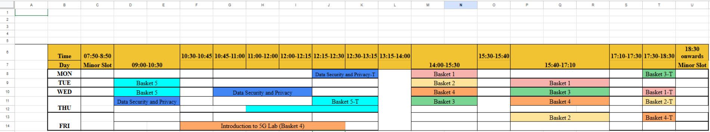
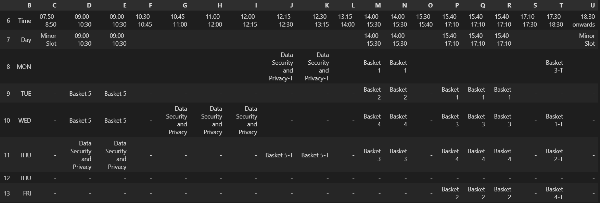

# 📅 Intelligent Timetable & Schedule Automator
> **Transforming messy spreadsheets into queryable intelligence.**


---

## 💡 The Problem We Solved

### ⚠️ The Challenge: "The Non-Standard Grid"
Most institutional timetables are designed for human eyes, not machines. This creates a "Data Desert" for automation:
*   **🧩 Merged Cells:** Visual blocks that hide data from standard CSV parsers.
*   **🕳️ Irregular Gaps:** Breaks and transitions that confuse linear search.
*   **🎭 Complex Baskets:** Overlapping elective slots that require contextual filtering.

### ✅ Our Solution
We built an **automated coordinate-mapping engine**. By reading the underlying XML structure of the spreadsheet via `openpyxl`, our tool "re-hydrates" every individual cell, ensuring 100% data continuity across merged ranges.
---

## 🔄 Data Transformation Pipeline

To bridge the gap between human-centric design and machine-readable data, the engine performs a complete structural overhaul of the source spreadsheet.

### 1️⃣ Initial State (Raw Spreadsheet)
The raw data contains merged cells and multi-layered headers that standard parsers cannot interpret correctly.


### 2️⃣ Final State (Intelligent Table)
The engine "hydrates" the grid, splitting merged cells and standardizing every slot into a queryable, 1:1 coordinate map.


---
---

## 🛠️ Tech Stack & Objects

*   **🐍 Python 3.12:** The backbone of the logic engine.
*   **🐼 Pandas:** High-performance indexing for the coordinate system.
*   **🔓 Openpyxl:** Deep-meta parsing to decode merged cell boundaries and metadata.
*   **🧪 Regex (re):** Pattern matching for natural language time extraction.
*   **🌐 Requests:** Real-time cloud synchronization with remote sources.

---

## ⚙️ Core Logic

| Phase | Object | Description |
| :--- | :---: | :--- |
| **Boundary Detection** | 📍 | Identifies grid anchors using keywords like `Time` and `Day`. |
| **Cell Hydration** | 💧 | Clones values from lead cells into all secondary merged coordinates using `openpyxl`. |
| **Temporal Parsing** | 🕰️ | Translates "tomorrow" or "10:45" into machine-readable calendar objects. |
| **Smart Consolidation** | 🔗 | Merges consecutive 15/30-min segments into single human blocks. |

---

## 🚀 Key Advantages

*   **✨ Zero Manual Entry:** Syncs directly via live URL.
*   **🧠 Context Awareness:** Automatically identifies "today" vs "tomorrow" using system clocks.
*   **🛡️ Gap Preservation:** Smart enough to know the difference between a merged lecture and a free period.
*   **💬 Human-Centric Output:** No column letters or row numbers—just clean times and subjects.

---

## 📖 Usage Examples
```python
# 📅 Get your full consolidated schedule for the day
assistant("What classes do I have today?")

# 🔍 Find every instance of a specific course
assistant("When is the Machine Learning session?")

# ⏱️ Check a specific time-window
assistant("Today 12:15 class")
